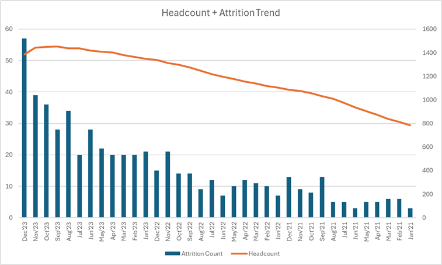

# 🚀 HR Attrition Risk Analytics Project

## 📌 Project Overview

This project analyzes employee attrition patterns and identifies key drivers influencing early exits within an organization.

The goal was to:
- Understand attrition behavior across tenure, departments, and workforce trends
- Build a realistic HR dataset
- Develop risk scoring logic
- Translate insights into actionable business recommendations

---

## 🧱 Dataset Design

A synthetic dataset was created to simulate a real-world HR environment:

- ~2000 employees
- 3-year timeline
- Multiple departments and roles
- Attrition events with timestamps

---

## 📊 Key Analysis Areas

- Attrition trend over time
- Attrition by tenure (early vs experienced employees)
- Department-wise attrition patterns
- Risk score vs actual attrition correlation
- Workforce growth vs attrition relationship

---

## 📈 Key Insights

### 1️⃣ Attrition is concentrated in early tenure
Most employee exits occur within the first 12 months.

👉 Indicates onboarding and early engagement issues

---

### 2️⃣ Support & Operations drive higher attrition
Certain operational roles show consistently higher exit rates.

👉 Suggests workload and expectation misalignment

---

### 3️⃣ Risk score is a strong predictor
Higher risk scores strongly correlate with actual attrition.

👉 Confirms effectiveness of risk modeling logic

---

### 4️⃣ Growth does not evenly distribute attrition
As workforce grows, attrition becomes more concentrated rather than proportional.

👉 Indicates structural issues rather than random churn

---

## 🧠 Approach

The project follows an end-to-end analytics workflow:

- Data design & simulation  
- Feature engineering  
- Risk scoring logic  
- Dashboard creation  
- Insight generation  

---

## 🛠 Tools Used

- Excel (initial analysis & validation)  
- Power BI (dashboarding & visualization)  
- Python (optional – data generation / transformation)  

---

## 📊 Dashboard Preview

---

## 📌 Business Recommendations

- Strengthen onboarding programs for first 90–180 days  
- Use risk scores for proactive retention actions  
- Review workload in Support & Operations  
- Improve hiring alignment for frontline roles  

---

## 🎯 What This Project Demonstrates

- Ability to design realistic datasets  
- Strong analytical thinking  
- Business-oriented insight generation  
- End-to-end project execution  

---

## 🔗 Live Project

👉 [View Project on Portfolio Website](https://legesh-analytics.github.io/hr-attrition-project.html)

---

## 🔗 Portfolio

👉 https://legesh-analytics.github.io/  

---

## 🔥 Final Note

This project reflects a real-world approach to HR analytics:

👉 Not just identifying attrition  
👉 But understanding **why it happens and how to act on it**
